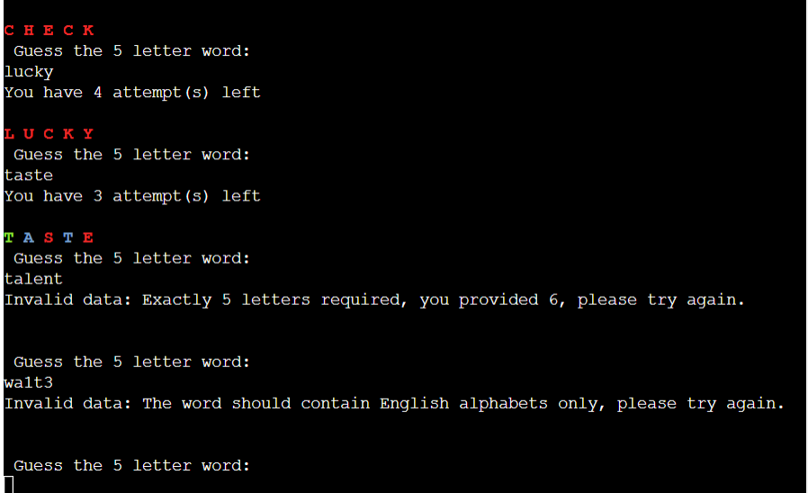

# Wordle    

Wordle is a web-based word puzzle game created and developed by Welsh software engineer Josh Wardle. Players have six attempts to guess a five-letter word, with feedback given for each guess in the form of colored tiles indicating when letters match or occupy the correct position. Wordle was purchased by The New York Times Company in January 2022 and moved to the newspaper's Games section in February. It is quite popular among internet users and the game became a viral phenomenon on Twitter in late December 2021. I personally used to play it everyday. So when I had to create a game, I didn't think twice before choosing Wordle.
I have created my version of Wordle with a few minor variations from the original game using Python.    

    

# Table of Contents:

- [Design](#design)
- [Features](#features)

	- [Existing Features](#existing-features) 

        -    [Language Used](#language-used)

        -    [Game Instructions](#game-instructions)    

        -    [Google Sheets](#google-sheets)    

        -    [Data Validations](#data-validations)  

        -    [Check Word](#check-word)  

   - [Future Features](#future-features)
- [Testing](#testing)   
     -    [Validator Testing](#validator-testing)  
     -    [Bugs](#bugs)

-    [Libraries and Programs Used](#libraries-and-programs-used)
- [Credits for Content and Media](#credits)  
- [Deployment](#deployment)
   

# Design:   

The flowchart for the application is as shown below:  

  

# Features

# Existing Features:
+ Game Instructions    
+ Google Sheets   
+ Data Validations
+ Check Word 
+ Display Messages    

# Language Used:
+ Python

# Game Instructions     

Wordle is a single player game. A player must guess a five letter English word in six attempts.
Your Progress Guide:
Green indicates that the letter and its position is correct.\n
Yellow indicates that the letter is there, but in a different position.\n
Red indicates that the letter not there in the word.    
   
  

# Data Validations

Data validations are done with the help of various functions checking the length of the input string, whether it has valid ASCII characters, whether the input string contains English alphabets only etc.    

  

# Check Word

Check word function compares the user input with the actual word and displays the relevant message to the user so that the game can be played. If the user guesses the word correctly, a message is displayed accordingly. In case the guess was partially correct, it will inform the same to the user. This function has a loop which gives the user six attempts to guess the hidden word.    

    

# Display Messages

Display messages functionality ensures proper message is displayed throughout the game so that the player understands the game progress. The player is prompted to enter a new guess each time a wrong guess is entered. Also, the number of attempts left is displayed. Similarly, even if the word entered is wrong, but one or more letters are correct, that is displayed. A different message is displayed in case the letter and its position in the word is correct. The player can understand the progress and make an informed decision for the next guess. When the player guess the hidden word correctly, a success message is displayed.    
 

# Future Features:  

+ Include validation to check whether the user input is a valid English word. If not, display an error message telling “Not a word”.
+ Include more words in the Google Sheets for better gaming experience.    
+ Improve the UI experience by including more colours and styles to indicate whether the user input is right or wrong.    

# Testing:  

The application is tested thoroughly by entering all sorts of valid and invalid user inputs and ensuring the application can handle it all without breaking the code.
I have tested the website on both Google Chrome (used for the development) and Microsoft Edge to ensure that the website worked on different browsers.

# Validator Testing:  

# Pep8ci:    

    
 

# Bugs:  

During the development phase, there were a few minor bugs which were fixed with the help of various tutorials available on Google.
There are no unfixed bugs existing in this website as per my knowledge.

# Libraries and Programs Used:  

* Code Repository: [GitHub](https://github.com/)
* Development IDE: [Gitpod](https://www.gitpod.io/)
* [Google Cloud]( https://console.cloud.google.com/)
* [Google Sheets API](https://console.cloud.google.com/apis/api/sheets.googleapis.com)
* [Google Drive API]( https://console.cloud.google.com/apis/api/drive.googleapis.com/)
* Validating Python: [PEP8]( https://pep8ci.herokuapp.com/)

# Credits for Content and Media:
* Flowchart: Powerpoint
* Basic game structure: [Free Code Camp]( https://www.freecodecamp.org/news/building-a-wordle-game/)
* Words used in Wordle: [Rock Paper Shotgun]( https://www.rockpapershotgun.com/wordle-past-answers)
* Print letters in a word horizonatally: [GeeksForGeeks](https://www.geeksforgeeks.org/print-a-list-in-python-horizontally/)
* Print colours in Python terminal: [Haoyi's Programming Blog](https://www.lihaoyi.com/post/BuildyourownCommandLinewithANSIescapecodes.html#8-colors)
* Love Sandwiches project
* My Mentor Martina for her guidance and the Slack Community for their support.

# Deployment:

This project is deployed using Code Institute's mock terminal for Heroku.

Steps for Deployment:

* Fork or clone the repository
* Set up Google Sheets and Google Drive APIs
* Download the Key json file from Google, upload it to the project. Change the name to creds.json
* Create a new Google Sheet named 'words'
* Add label one worksheet 'words' and add the desired content to the sheet.
* Create new Heroku app
* Set the buildpacks to python and node.js (in the same order mentioned)
* Link the Heroku app to the repository
* Click Deploy    

_Note:_ The live website link: https://wordle-python-ec6f7a74fed2.herokuapp.com/
